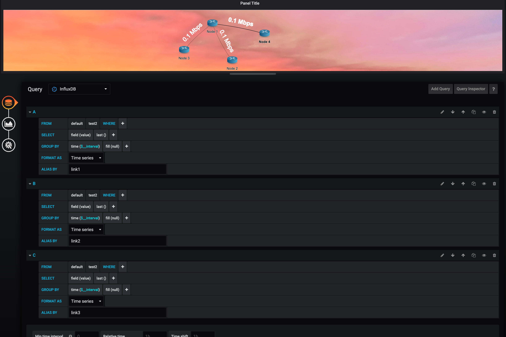

# Cisco Topology Plugin

This plugin allow to draw dynamic network topologies on top of a Grafana panel.

## Build the plugin

[Setup grafana](http://docs.grafana.org/project/building_from_source) and clone the Cisco Topology Plugin into /var/lib/grafana/plugins or data/plugins (relative to grafana git repo if you’re running development version from source dir).

Install the dependencies:
```bash
yarn install
```

To work with the plugin run:
```bash
yarn dev
```

To build the plugin run:
```bash
yarn build
```

## Usage

After installing the plugin, from the main page of grafana create a new dashboard and then a new panel:


From the visualization list, choose the Cisco Topology Plugin visualization:


The new panel will be created with a default network os 2 routers connected together. Modify the json for adding/removing link/nodes. The json format is the same used by vis.js when describing the topology. You can provide the options described [here](https://visjs.github.io/vis-network/docs/network/nodes.html) (for nodes) and [here](https://visjs.github.io/vis-network/docs/network/edges.html) (for edges). Feel free to customize tour topology as much as you need :)

This plugin offers the following groups, which can be used for customize the icon of the node:

- router

If you do not provide a group, a standard shape will be used.


Optionally you can add a background image to your panel, by specifying the image URL in the Background text area:


Let's start adding some animation. The only supported animation for the moment is the dynamic width change of the links, depending on the amount of traffic which is flowing. The traffic is taken from a datasource, like influxdb or Prometheus. So the first step is to add the queries in order to get the bandwidth of the links from a time series database. In the example below I am performing 4 queries to influxdb, retrieving the same field (test2). Then the result of every query must be aliased with the ID of the link provided in the json, in order to associate the measurement to the link (in the picture `link1`, `link2` and `link3`).

If you have multiple queries and you want to show the sum of the results in a single link, just alias all the quesries with the same link id ;)



And this will be the result, which will update with the rate of your dashboard refresh :)


